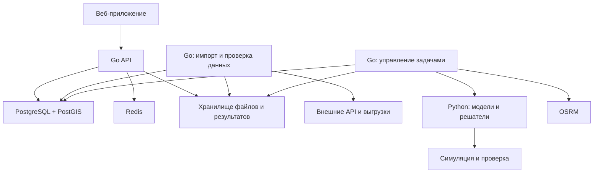

# Система комплексного планирования зарядной инфраструктуры

## 1. Цель и конкурентное преимущество
Результат — инвестиционный и инженерный план развития сети:

- Площадки, оборудование, количество постов и доступная мощность.
- Подключения, усиление сети, накопители и локальная генерация.
- Очерёдность строительства и распределение бюджета по годам.
- Работа частного транспорта, такси, корпоративных парков и электробусов.
- Доступность зарядки, очереди, выполнение расписаний и устойчивость к отказам.
- Экономический результат, риски и условия, при которых рекомендации изменятся.

Такое разделение на планирование сети, проектирование площадки и экономическую оценку соответствует направлениям профессиональных инструментов EVI-X. Используем их как ориентир по полноте задачи; российские параметры и ограничения формируем отдельно. [NREL EVI-X](https://www.nrel.gov/transportation/evi-x.html).

### Что должно выделять решение

| Возможность | Практический результат |
|---|---|
| Совместный выбор зарядок и энергоснабжения | Сравнение строительства в другой точке, усиления подключения, накопителя и управления зарядкой |
| Планирование при неопределённости | Решение сохраняет приемлемые показатели при ошибке прогноза |
| Разные модели транспорта | Такси и электробусы рассчитываются с учётом их реальных режимов эксплуатации |
| Поэтапные инвестиции | Понятно, что строить сейчас и когда расширять сеть |
| Несколько эффективных альтернатив | Пользователь видит компромисс между стоимостью, доступностью и риском |
| Проверка рекомендаций симуляцией | Показано, как выбранная сеть работает во времени |
| Объяснение и анализ чувствительности | Понятно, почему выбран объект и какие данные нужно уточнить |

Основные пользовательские режимы сохраняются:

1. **Оператор:** экономически эффективное развитие сети при заданном качестве обслуживания.
2. **Город:** доступность зарядки и транспортная надёжность при ограниченных ресурсах.

Транспортный парк и энергоснабжение — специализированные расчётные представления внутри этих режимов.

География задаётся полигоном, административной территорией или транспортным коридором. Названия городов, тарифы и коэффициенты спроса не зашиваются в алгоритмы.

## 2. Математическое и инженерное ядро

### 2.1. Модель спроса

Спрос строится из транспортного поведения, доступности домашней зарядки и потребности в энергии. Точки притяжения служат признаками для пространственного распределения.

| Сегмент | Что моделируем |
|---|---|
| Частные автомобили | Поездки, стоянки, домашнюю зарядку, начальный заряд, выбор публичной станции |
| Такси | Смены, пробег, зарядку между заказами, стоимость простоя |
| Корпоративный и коммунальный транспорт | Задания, возвращение на базу, доступные окна зарядки |
| Электробусы | Рейсы, обороты, депо, конечные остановки, заряд перед следующим выездом |
| Междугородние поездки | Маршруты, запас хода и достижимость последовательных зарядных остановок |

Учитываем сезонность, рабочие и выходные дни, температуру, энергопотребление и деградацию батареи. Каждый коэффициент имеет источник или отметку о сценарном характере.

Предусматриваем два способа получения спроса:

- **При отсутствии истории:** параметрическая модель и синтетические поездки, согласованные с известными агрегатами.
- **При наличии истории:** прогнозирование через CatBoost с временной проверкой и сравнением с сезонным базовым прогнозом.

ML-модель допускается к расчётам только после проверки на отложенных данных. До этого система использует явные предположения и диапазоны неопределённости.

### 2.2. Совместная оптимизация инфраструктуры

Основная постановка — **многопериодная смешанно-целочисленная оптимизация**.

Решения модели:

- Открытие, расширение и год ввода станции.
- Количество и типы постов.
- Мощность подключения и её увеличение.
- Выбор допустимого узла подключения.
- Мощность и энергоёмкость накопителя.
- Установка локальной генерации при наличии подходящей площадки.
- Распределение зарядной нагрузки по времени.
- Обслуживание спроса и допустимый дефицит обслуживания.

Ограничения:

- Годовой и общий инвестиционные бюджеты.
- Доступность земли, площадь, число парковочных мест и сроки ввода.
- Совместимость оборудования и транспорта.
- Дорожная доступность, режим работы площадок.
- Мощность отдельных постов, станции, подключения и общих узлов сети.
- Энергетический баланс, потери, ограничения накопителей.
- Обязательные рейсы и минимальный заряд транспорта.
- Закреплённые пользователем решения.
- Существующие активы и уже принятые инвестиционные обязательства.

**Различаем установленную мощность оборудования, договорный предел подключения и фактическое потребление.** Управляемая зарядка позволяет распределять ограниченный ресурс, но не отменяет требования к подключению.

Стек модели: **Python + Pyomo + HiGHS**. HiGHS содержит готовый вычислительный движок на C++ и поддерживает смешанно-целочисленные задачи; собственный C++-сервис на старте не требуется. [HiGHS](https://highs.dev/).

### 2.3. Цели и эффективные альтернативы

Для оператора рассчитываем NPV, операционный денежный поток, инвестиции, стоимость обслуживания энергии и окупаемость. Ограничения качества обслуживания задаются отдельно.

Для города основной критерий — уменьшение необслуженного спроса, включая минимальные требования к покрытию районов. Следующие критерии — доступность по времени поездки и стоимость.

Не объединяем всё в непрозрачный «рейтинг 87 баллов». Формируем **набор недоминируемых планов** через последовательное изменение требований к покрытию и бюджету:

- Наименьшие необходимые инвестиции.
- Максимальная экономическая отдача.
- Повышенная доступность.
- Повышенная устойчивость.
- Компромиссный вариант.

У каждого плана — одинаково рассчитанные показатели. «Сбалансированность» не выдаётся за объективный математический оптимум: она определяется выбранными пользователем требованиями.

В режиме оператора допустим вывод, что при заданных условиях строительство экономически нецелесообразно.

### 2.4. Неопределённость и развитие по годам

Сценарии включают рост электротранспорта, изменение тарифов и затрат, сезонность, отказ оборудования и задержку подключения.

Предусматриваем два режима:

- **Без обоснованных вероятностей:** робастная оптимизация по заданному набору сценариев.
- **С заданными вероятностями:** ожидаемый результат и ограничение потерь через CVaR.

Инвестиционный план общий для сценариев; эксплуатационные решения могут различаться. Модель не должна выбирать сегодняшнее строительство, используя знание того, какой сценарий наступит.

Первый вариант многолетнего расчёта — общий график инвестиций с ежегодным пересмотром на новых данных. Это явно отличается от адаптивной стратегии, знающей будущее.

Разделение инвестиционных и эксплуатационных решений, а также CVaR применяются в моделях энергетического планирования. Используем эти постановки как методическую основу, не предполагая, что библиотека автоматически решает всю нашу предметную задачу. [PyPSA: stochastic optimization](https://docs.pypsa.org/latest/user-guide/optimization/stochastic/).

### 2.5. Электросеть, накопители и генерация

Поддерживаем два уровня энергетических данных:

1. **Ограничения подключения:** доступная мощность, временные профили, стоимость и сроки усиления.
2. **Полная схема сети:** линии, трансформаторы, электрические параметры и фоновые нагрузки.

На первом уровне проверяем лимиты мощности. На втором дополнительно проверяем напряжения и загрузку элементов через pandapower. При отсутствии схемы результат не называется проверкой электрического режима. [pandapower](https://pandapower.readthedocs.io/en/latest/powerflow/ac.html).

Для накопителя обязательны:

- Баланс энергии между интервалами.
- Пределы мощности и состояния заряда.
- КПД и деградационные расходы.
- Запрет физически бессмысленных одновременных режимов.
- Корректные начальные и конечные условия.

Сезонные периоды не получают «бесплатный» запас энергии при каждом новом запуске. Представительные сутки используются для предварительного подбора, а финальные планы проверяются на последовательных временных отрезках.

Генерация учитывается по временным профилям; ограничения площади, присоединения и выдачи энергии задаются входными данными.

### 2.6. Электробусы и транспортные парки

Для электробусов реализуем отдельную модель расписания зарядки:

- Энергия на каждом рейсе.
- Заряд до отправления и после возвращения.
- Доступные окна в депо и на конечных.
- Конкуренция автобусов за посты и мощность.
- Перегоны до зарядки.
- Ограничения батареи и кусочно-линейная зарядная характеристика.

Поддерживаем импорт GTFS и нормализованных CSV. Сам GTFS не предоставляет всех энергетических параметров: характеристики машин и связи рейсов с транспортными единицами загружаются отдельно. [GTFS Schedule](https://gtfs.org/documentation/schedule/reference/).

Проверка завершается ответом: какие рейсы обеспечены зарядом, где возникает конфликт и какой ресурс устраняет проблему.

### 2.7. Симуляция и обратная проверка

После оптимизации запускаем событийную модель SimPy:

- Прибытия, выбор станции, очереди, отказы и повторный выбор.
- Изменение состояния батарей.
- Совместное использование мощности.
- Отказы постов, ремонт и недоступность площадок.
- Отклонения спроса и времени поездки.
- Расписания транспортных парков.

Планировщик и симулятор используют общий формат входа, но разную логику: симулятор не воспроизводит назначения оптимизатора как заранее гарантированное поведение.

Если план не проходит эксплуатационные требования, система добавляет ограничение, пересчитывает его и сохраняет историю итераций. Ограничиваем число итераций вычислительным бюджетом; по завершении возвращаем лучший проверенный вариант или явное описание невыполненных требований.

### 2.8. Масштабирование расчёта

Используем:

- Иерархическую пространственную сетку H3.
- Разреженные связи между спросом и достижимыми площадками.
- Агрегирование времени для предварительного отбора.
- Детализацию перспективных участков.
- Повторное использование матриц маршрутов.
- Параллельные расчёты сценариев и симуляций.
- Начальные допустимые планы для ускорения решателя.

Общий бюджет и разделяемые ограничения сети сохраняются в согласованной модели: независимые решения по районам не должны конфликтовать на общей подстанции.

Для каждого результата указываем область поиска, применённые упрощения и статус решателя. Оптимальность на сокращённом наборе кандидатов не выдаётся за доказанную оптимальность для всей территории.

## 3. Бэкенд, база данных и внешние источники

### Архитектура

Основной бэкенд — модульный Go-проект. Вычисления изолированы от пользовательского API.

Модули Go:

- Доступ пользователей и проекты.
- География и источники данных.
- Каталог оборудования и энергоснабжение.
- Сценарии и версии.
- Расчётные задачи.
- Результаты, сравнение и экспорт.
- Аудит действий.

Python содержит предметные модели спроса, размещения, энергетики, транспортных парков, симуляции и экономики. Он не становится вторым публичным бэкендом.

PostgreSQL/PostGIS хранит долговечные данные. Redis используется для кэша и ускорения уведомлений. Географические слои выдаются как векторные тайлы; отдельные объекты — GeoJSON.

Исходные файлы, матрицы и крупные результаты хранятся через единый интерфейс артефактов: локальный volume для самостоятельного развёртывания, S3-совместимый backend для распределённого.

### Модель данных

| Область | Основные сущности |
|---|---|
| Доступ | Пользователи, проекты, участники и роли |
| Происхождение | Источники, наборы, версии, лицензии, результаты проверки |
| Территория | Регионы, зоны спроса, POI, площадки, дорожные матрицы |
| Инфраструктура | Станции, посты, оборудование, ограничения площадок |
| Энергетика | Узлы, линии, подключения, профили мощности, накопители, генерация |
| Транспорт | Сегменты, машины, маршруты, рейсы, смены, зарядные сессии |
| Планирование | Сценарии, версии параметров, инвестиционные периоды |
| Выполнение | Задачи, попытки, события, артефакты |
| Результаты | Планы, инвестиции, расписания, метрики, объяснения |

Пространственные данные нормализуются в PostGIS. JSONB применяется к параметрам и снимкам модели, не заменяя всю предметную схему.

Единицы измерения фиксируются в контрактах. Временные профили содержат часовой пояс территории. Денежные значения в БД хранятся точно; переход к числам решателя выполняется с явным масштабированием.

Каждый расчёт фиксирует версии входных наборов, моделей и зависимостей, параметры решателя, случайные seed и хеш входа.

### Источники и переносимость

Внешние интеграции выполняются через заменяемые адаптеры:

- OSM/Geofabrik — география, дороги, площадки и инфраструктурные объекты.
- OSRM — маршруты и матрицы доступности.
- Государственные и муниципальные выгрузки — при подтверждённой доступности.
- GTFS/CSV — общественный транспорт.
- API операторов и зарядные сессии — при предоставлении доступа.
- Погодные данные и профили генерации — через отдельные адаптеры.

Каждая загрузка проходит проверку структуры, координат, единиц, дублей и временного покрытия. Неизвестные значения не подменяются нулём.

**Данные делятся на наблюдаемые, вычисленные и предположенные на уровне полей.** Пользователь может заменить предположение своим значением и увидеть изменение результата.

Демонстрационные территории выбираем по проверяемым критериям: наличие пригодных данных, право использования, возможность воспроизведения и содержательное отличие кейса. Город не влияет на архитектуру.

## 4. Контракты, надёжность и работа команды

### Публичные интерфейсы

Контракт — OpenAPI 3.1, версия `/api/v1`.

| Группа | Основные операции |
|---|---|
| Проекты | Создание, участники, роли |
| Данные | Источники, импорт, состояние проверки, версии |
| Карта | Тайлы, объекты, инфраструктура, качество данных |
| Сценарии | Создание версии, параметры, закрепление решений |
| Расчёты | Запуск, состояние, события, отмена |
| Результаты | Планы, временные ряды, расписания, ограничения |
| Анализ | Сравнение, чувствительность, повторный расчёт без выбранного объекта |
| Экспорт | JSON, CSV, GeoJSON, печатный отчёт |

Основные типы:

- `ScenarioSpec` — территория, цель, периоды, сегменты и ограничения.
- `DatasetManifest` — версии и происхождение входных данных.
- `RunSpec` — модель, сценарии неопределённости и вычислительный бюджет.
- `PlanResult` — инфраструктура, график инвестиций, показатели и допущения.
- `ValidationReport` — выполненные проверки и обнаруженные нарушения.

Фронтенду выдаются сгенерированные типы и примеры ответов. События расчёта передаются по SSE с восстановлением по идентификатору события; polling остаётся резервным способом.

Внутреннее взаимодействие Go–Python — версионированный HTTP/JSON-контракт. Крупные входы передаются ссылками на контролируемые артефакты, а не произвольными внешними URL.

### Надёжность

- Задание и входной снимок создаются транзакционно в PostgreSQL.
- Worker использует аренду, heartbeat и идентификатор попытки.
- Повторное выполнение допустимо; публикация результата идемпотентна.
- Просроченная попытка не может перезаписать актуальную.
- Этапы расчёта сохраняют контрольные точки.
- Таймаут, отмена и лимит памяти применяются к отдельному вычислительному процессу.
- Ошибки данных, несовместимые ограничения и временные сбои обрабатываются отдельно.
- Недоступность Redis не приводит к потере задач или результатов.

Доступ разграничивается ролями администратора, аналитика и наблюдателя. Проверяется принадлежность каждого объекта проекту. Секреты внешних API не передаются в браузер.

Наблюдаемость: структурированные логи, трассировка этапов, глубина очереди, возраст задач, время импорта, построения модели, решения и симуляции.

### Ответственность команды

| Участник | Направление |
|---|---|
| Вы | Архитектура, Go API, модель данных, управление задачами, интеграция и проверка вычислительного ядра |
| Фронтендер 1 | Карта, географические слои, инфраструктура, редактирование площадок |
| Фронтендер 2 | Сценарии, сравнение планов, экономика, расписания и объяснения |
| DevOps | Контейнеры, CI/CD, вычислительные ресурсы, маршрутизация, хранение, мониторинг и восстановление |

Работа разделяется по стабильным контрактам. Вычислительная модель оформляется самостоятельным пакетом с тестовыми входами, чтобы её можно было развивать независимо от Go и интерфейса.

## 5. Реализация, доказательства качества и конкурсная демонстрация

### Последовательность реализации

Этапы определяются зависимостями, а не искусственным ограничением функциональности.

| Этап | Результат и условие завершения |
|---|---|
| **1. Спецификация** | Предметная модель, OpenAPI, схема БД, формулы, единицы, тестовые примеры и критерии корректности согласованы |
| **2. Данные и платформа** | Импорт территории, карта, версии данных и надёжный запуск расчётов работают сквозным образом |
| **3. Размещение** | Два режима, существующая сеть, бюджет и подключения; оптимизатор проверен на малых задачах |
| **4. Эксплуатация** | Симуляция, конкуренция станций, очереди, энергобаланс и экономика связаны с результатом размещения |
| **5. Энергетика и парки** | Работают накопители, генерация, усиление сети, расписания зарядки и проверка рейсов |
| **6. Развитие и риски** | Многолетний план, робастные сценарии, альтернативы и анализ чувствительности |
| **7. Верификация** | Сравнительные эксперименты, проверка масштаба, восстановление после сбоев и воспроизводимые отчёты |

Каждый этап заканчивается работающим сквозным результатом. Последующие возможности расширяют его, сохраняя проверяемость уже реализованного.

### Как доказываем преимущество

Используем одинаковые данные, бюджеты и эксплуатационные сценарии для следующих подходов:

1. Существующая сеть.
2. Размещение по плотности спроса.
3. Жадное размещение с учётом допустимости подключения.
4. Пространственная оптимизация без подробной динамики.
5. Полная модель.

Дополнительно отключаем отдельные компоненты полной модели и измеряем их вклад: энергетику, очереди, неопределённость, накопители и этапность.

Отдельно выделяем модели, нарушающие физические ограничения: их привлекательная экономика не считается допустимым результатом.

Измеряем:

- Обслуженный спрос и отпущенную энергию.
- Доступность по дорожному времени.
- Очереди, отказы и перераспределение нагрузки.
- Выполнение рейсов.
- Нарушения энергетических ограничений.
- CAPEX, OPEX, NPV и стоимость обслуживания.
- Ухудшение при отказах и ошибках прогноза.
- Время расчёта, память и статус оптимальности.

Параметры подбираются на одном наборе сценариев, итоговая проверка выполняется на другом. Для симуляционного сравнения используем одинаковые потоки прибытий и не менее 30 независимых seed; показываем разброс и интервалы для разности показателей. Эти интервалы характеризуют модельную случайность, а не подтверждают достоверность исходных предположений.

### Обязательные технические проверки

- Сравнение оптимизатора с полным перебором на маленьких задачах.
- Проверка сохранения энергии и спроса.
- Проверка SoC транспорта и накопителей.
- Отсутствие двойного расходования бюджета и мощности.
- Проверка временных границ рейсов и зарядных окон.
- Запрет использования информации из будущего при принятии текущих решений.
- Тесты на противоречивые ограничения и объяснение невозможности расчёта.
- Потеря worker, повтор сообщения, отмена, отказ Redis и восстановление БД.
- Разделение доступа между проектами.
- Испытания нескольких размеров задачи с публикацией характеристик стенда.

Для прогноза спроса — временная проверка без утечки будущих данных и сравнение с простыми прогнозами. Для переносимости — запуск на территории, не использованной при настройке модели.

### Три конкурсных кейса

**Агломерация.** Сравнить развитие публичной сети: бюджет, доступность, очереди и ограничения электросети.

**Транспортный парк.** Показать, как зарядное расписание обеспечивает рейсы и уменьшает необходимую пиковую мощность.

**Междугородний коридор.** Показать достижимость цепочки зарядок, сезонное уменьшение запаса хода и последствия отказа одной станции.

Для каждого кейса показываем качество данных. Реальная география с синтетическим спросом обозначается именно так.

### Центральный сценарий защиты

1. Загрузить территорию и показать происхождение данных.
2. Рассчитать несколько альтернатив развития.
3. Объяснить выбранные площадки и оборудование.
4. Запустить работу сети во времени.
5. Увеличить спрос, ограничить подключение или отключить станцию.
6. Показать изменение качества обслуживания.
7. Сравнить способы устранения проблемы: новая площадка, расширение, накопитель, управление зарядкой.
8. Выдать инвестиционный план и воспроизводимый отчёт.

Итоговый комплект: код, архитектурные решения, OpenAPI, миграции, спецификация моделей, адаптеры данных, контейнеры, CI, тесты, экспериментальные результаты, три демонстрационных кейса и документация эксплуатации.

**Целевая планка — система, чьи рекомендации можно проверить математически, воспроизвести технически и защитить предметно перед жюри.**
