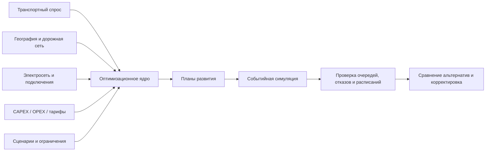
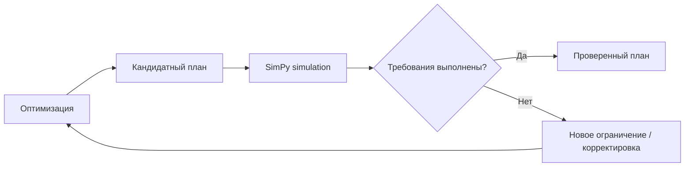
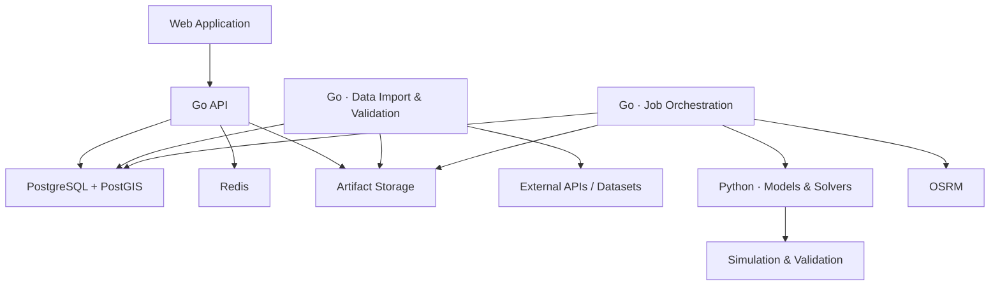
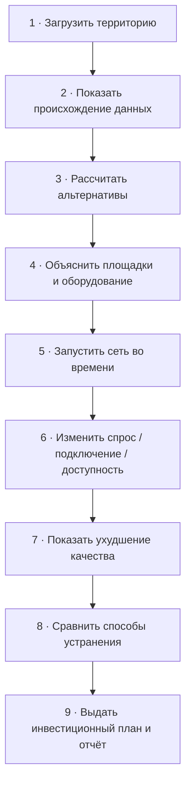

<div align="center">


# EV Infrastructure Planning System
### Система комплексного планирования зарядной инфраструктуры

**Инженерно-инвестиционная платформа для проектирования, развития и проверки сетей зарядной инфраструктуры электротранспорта.**

<br>


<br>


<br>

> **Где, когда и какую зарядную инфраструктуру построить, как обеспечить её энергией  
> и как она будет работать при разных вариантах развития транспорта?**

</div>

---

> **Начните с [пошагового запуска](START_HERE.md).** Для карты 2ГИС заполните `DGIS_MAPGL_API_KEY` в `.env`; без ключа оптимизация продолжит работать. Встроенное демо использует явно обозначенные синтетические данные. Пользователь может загрузить собственный расчётный сценарий, построить профиль из наблюдаемых зарядных сессий и дорожную матрицу по OSM/OSRM. Это ещё не означает, что спрос и резервы электросети для произвольной территории автоматически известны: фактические возможности и ограничения перечислены в [статусе реализации](docs/IMPLEMENTATION_STATUS.md).

Симуляция отдельно проверяет работу публичных постов, подключений, общей мощности узла, PV и накопителя с минутным шагом. Накопитель начинает моделируемые сутки пустым; результаты по диспетчеризации и физическому аудиту доступны в `simulation[].dispatch_by_site` и `simulation[].dispatch_verification`. Для CSV зарядных сессий теперь отдельно рассчитываются часы начала, средний объём сессии и эмпирическое распределение энергии. `operational_validation[]` показывает разрыв в доле обслуживания между почасовым оптимизатором и событийной проверкой; `operational_economics[]` пересчитывает сценарный NPV по фактически смоделированным энергии и сетевому потреблению. [Как интерпретировать расчёт на реальных данных](docs/REAL_DATA_CALCULATION.md).

## О проекте

Система превращает разрозненные транспортные, пространственные, энергетические и экономические данные в **проверяемый план развития зарядной инфраструктуры**.

Она предназначена не только для ответа на вопрос *«где поставить зарядки»*. Цель проекта — совместно определить:

- где открывать и расширять зарядные станции;
- сколько и каких зарядных постов устанавливать;
- какую мощность подключения закладывать;
- когда усиливать электросеть;
- где использовать накопители или локальную генерацию;
- как распределять инвестиции по годам;
- как будет работать сеть при росте спроса, сбоях и ограничениях;
- насколько план экономически оправдан;
- какие исходные предположения сильнее всего влияют на результат.

Итогом становится **инвестиционный + инженерный + эксплуатационный план**, который можно воспроизвести, проверить и сравнить с альтернативами.

---

## Ключевая идея

Большинство упрощённых подходов рассматривают зарядную инфраструктуру изолированно: отдельно спрос, отдельно географию, отдельно электрическую мощность.

Этот проект связывает их в одну расчётную систему:



Оптимизатор предлагает инфраструктуру, а независимая эксплуатационная симуляция проверяет, **как эта инфраструктура действительно ведёт себя во времени**.

---

## Для кого

### 🏢 Оператор зарядной сети

Цель — получить экономически эффективный план развития при заданном качестве обслуживания.

Система помогает оценивать:

- CAPEX и OPEX;
- NPV и денежный поток;
- окупаемость;
- стоимость обслуживания энергии;
- очереди и отказы;
- загрузку станций;
- необходимость расширения подключения;
- момент следующего этапа инвестиций.

### 🏙️ Город / регион

Цель — повысить доступность зарядки и транспортную надёжность при ограниченном бюджете.

В центре внимания:

- необслуженный спрос;
- дорожное время до зарядки;
- территориальное покрытие;
- устойчивость инфраструктуры;
- бюджет;
- ограничения электросети;
- развитие по годам.

---

## Что умеет система

| Возможность | Практический результат |
|---|---|
| **Совместная оптимизация зарядок и энергоснабжения** | Можно сравнивать новую площадку, усиление подключения, накопитель и управление зарядкой |
| **Многолетнее планирование** | Видно, что строить сейчас и когда расширять сеть |
| **Работа с неопределённостью** | План можно проверить на рост спроса, тарифов, задержки подключений и отказы |
| **Несколько типов транспорта** | Частные авто, такси, корпоративные парки, коммунальный транспорт, электробусы |
| **Несколько эффективных альтернатив** | Пользователь видит компромисс между стоимостью, доступностью и устойчивостью |
| **Событийная симуляция** | Проверяются очереди, конкуренция за мощность, отказы и повторный выбор станции |
| **Энергетическая проверка** | Учитываются подключения, накопители, генерация и при наличии схемы — электрический режим |
| **Объяснимость** | Для результата фиксируются допущения, ограничения, входные версии и причины выбора |
| **Воспроизводимость** | Расчёт хранит версии данных, моделей, solver-параметры, seed и hash входа |

---

## Поддерживаемые модели транспорта

```text
Частные автомобили
├── поездки
├── стоянки
├── домашняя зарядка
├── начальный State of Charge
└── выбор публичной станции

Такси
├── смены
├── пробег
├── зарядка между заказами
└── стоимость простоя

Корпоративные / коммунальные парки
├── задания
├── возврат на базу
└── доступные окна зарядки

Электробусы
├── рейсы и обороты
├── депо и конечные
├── энергия на рейс
├── конкуренция за посты
└── обязательный заряд перед выездом

Междугородние поездки
├── маршруты
├── запас хода
└── достижимость цепочки зарядных остановок
```

---

## Математическое ядро

Основная постановка — **многопериодная смешанно-целочисленная оптимизация**.

### Решения модели

Модель может выбирать:

- открытие станции;
- расширение станции;
- год ввода;
- количество зарядных постов;
- типы оборудования;
- мощность подключения;
- узел подключения;
- усиление подключения;
- мощность накопителя;
- энергоёмкость накопителя;
- локальную генерацию;
- распределение зарядной нагрузки по времени;
- объём обслуженного спроса;
- допустимый дефицит обслуживания.

### Ограничения

Учитываются:

- годовой и общий инвестиционные бюджеты;
- доступность земли;
- площадь площадки;
- парковочные места;
- сроки ввода;
- совместимость транспорта и оборудования;
- дорожная доступность;
- режим работы площадки;
- мощность отдельных постов;
- мощность станции;
- договорный предел подключения;
- ограничения общих сетевых узлов;
- энергетический баланс;
- потери;
- ограничения накопителей;
- обязательные рейсы;
- минимальный State of Charge;
- существующие активы;
- уже принятые инвестиционные обязательства;
- решения, закреплённые пользователем.

> Установленная мощность оборудования, договорный предел подключения и фактическое потребление рассматриваются как разные величины.

---

## Оптимизация ≠ один непрозрачный рейтинг

Система не сводит разнотипные цели к условной оценке вроде *«87/100»*.

Вместо этого строится **набор недоминируемых планов**, например:

- минимально необходимые инвестиции;
- вариант с максимальной экономической отдачей;
- вариант повышенной доступности;
- вариант повышенной устойчивости;
- компромиссный вариант при выбранных пользователем ограничениях.

Все варианты сравниваются по одним и тем же метрикам.

Для оператора допустим и важен результат:

> **При заданных условиях строительство экономически нецелесообразно.**

---

## Неопределённость и сценарии

Система рассчитана не только на один «идеальный» прогноз.

Сценарии могут включать:

- рост количества электромобилей;
- изменение тарифов;
- изменение стоимости оборудования;
- сезонность;
- температурные эффекты;
- отказ зарядных постов;
- недоступность площадок;
- задержку технологического присоединения;
- изменение транспортных потоков.

Поддерживаются два подхода:

### Robust Optimization

Используется, когда надёжных вероятностей сценариев нет.

План должен сохранять приемлемые свойства на заданном наборе возможных будущих состояний.

### Stochastic / CVaR

Используется, когда сценариям можно обоснованно назначить вероятности.

Тогда система может учитывать:

- ожидаемый результат;
- риск неблагоприятных исходов;
- ограничение потерь через CVaR.

Инвестиционные решения являются общими для сценариев, а эксплуатационные решения могут адаптироваться.

---

## Энергетическая модель

Поддерживаются два уровня детализации.

### 1. Ограничения подключения

Если полной схемы сети нет, используются:

- доступная мощность;
- временные профили;
- стоимость усиления;
- сроки усиления;
- лимиты подключения.

### 2. Полная схема сети

Если доступны:

- линии;
- трансформаторы;
- электрические параметры;
- фоновые нагрузки;

дополнительно выполняется проверка электрического режима через **pandapower**.

> Если полной электрической схемы нет, результат не выдаётся за полноценную проверку режима сети.

### Накопители

Для BESS учитываются:

- энергетический баланс между интервалами;
- ограничения мощности;
- State of Charge;
- КПД;
- деградационные расходы;
- физически допустимые режимы;
- начальные и конечные условия.

---

## Электробусы и транспортные парки

Для электробусов используется отдельная модель зарядного расписания.

Она учитывает:

- энергию на каждом рейсе;
- заряд до отправления;
- заряд после возвращения;
- окна зарядки в депо;
- окна зарядки на конечных;
- конкуренцию автобусов за посты;
- общий лимит мощности;
- перегоны к зарядке;
- ограничения батареи;
- кусочно-линейную зарядную характеристику.

Импортируются **GTFS** и нормализованные CSV.

При этом GTFS используется для транспортной части, а энергетические характеристики машин и связи рейсов с конкретными транспортными единицами задаются отдельно.

Результат проверки отвечает на три вопроса:

1. Какие рейсы обеспечены зарядом?
2. Где возникает конфликт?
3. Какой дополнительный ресурс устраняет проблему?

---

## Симуляция эксплуатационной работы

После оптимизации запускается событийная модель на **SimPy**.

Она моделирует:

- прибытия;
- выбор станции;
- очереди;
- отказы;
- повторный выбор;
- изменение заряда батареи;
- совместное использование мощности;
- недоступность постов;
- ремонт;
- отклонение спроса;
- отклонение времени поездки;
- расписания транспортных парков.



Симулятор не повторяет назначения оптимизатора как заранее гарантированное поведение — он проверяет план независимой логикой.

---

## Архитектура



### Принцип разделения

**Go** отвечает за:

- API;
- пользователей и проекты;
- версии данных;
- сценарии;
- управление задачами;
- результаты;
- аудит;
- интеграции;
- надёжность исполнения.

**Python** отвечает за:

- модель спроса;
- пространственную оптимизацию;
- энергетику;
- транспортные парки;
- MILP;
- симуляцию;
- экономику.

Python-часть не превращается во второй публичный backend.

---

## Технологический стек

| Слой | Технологии |
|---|---|
| **Backend** | Go |
| **Optimization** | Python, Pyomo, HiGHS |
| **Simulation** | SimPy |
| **Database** | PostgreSQL + PostGIS |
| **Cache / notifications** | Redis |
| **Routing** | OSRM |
| **Spatial indexing** | H3 |
| **Power flow** | pandapower |
| **ML demand forecasting** | CatBoost |
| **Public transport** | GTFS / normalized CSV |
| **API contract** | OpenAPI 3.1 |
| **Async progress** | SSE + polling fallback |
| **Artifacts** | Local volume / S3-compatible storage |
| **Geodata delivery** | Vector tiles + GeoJSON |

---

## Данные

Система работает с заменяемыми адаптерами источников.

Предполагаемые классы источников:

- OSM / Geofabrik;
- OSRM;
- государственные и муниципальные выгрузки;
- GTFS;
- операторские данные;
- зарядные сессии;
- погодные данные;
- профили локальной генерации.

Каждый импорт проходит проверки:

- структуры;
- координат;
- единиц измерения;
- дублей;
- временного покрытия.

Неизвестные значения **не подменяются нулём**.

### Provenance

Каждое поле по происхождению относится к одной из категорий:

- **observed** — наблюдаемое;
- **computed** — вычисленное;
- **assumed** — предположенное.

Пользователь может заменить предположение своим значением и увидеть, как это изменит результат.

---

## Модель спроса

Поддерживаются два режима.

### Без исторических данных

Используются:

- параметрическая модель;
- синтетические поездки;
- известные агрегаты;
- пространственные признаки;
- сценарные диапазоны.

### С историческими данными

Используется прогнозирование через **CatBoost** с:

- временным train/validation разделением;
- проверкой на отложенном периоде;
- сравнением с сезонным baseline;
- защитой от утечки будущих данных.

ML-модель допускается к итоговым расчётам только после проверки качества.

---

## Масштабирование

Для больших территорий используются:

- иерархическая сетка H3;
- разреженные связи между зонами спроса и достижимыми площадками;
- предварительная агрегация времени;
- детализированный пересчёт перспективных участков;
- переиспользование маршрутных матриц;
- параллельные сценарии;
- параллельные симуляции;
- warm-start / начальные допустимые планы.

Общие бюджеты и общие ограничения электросети остаются согласованными: локальная оптимизация районов не должна создавать конфликт на общей подстанции.

---

## API

Публичный контракт проектируется на **OpenAPI 3.1** с версией:

```text
/api/v1
```

Основные группы:

| Группа | Назначение |
|---|---|
| `projects` | проекты, участники, роли |
| `datasets` | источники, импорт, валидация, версии |
| `map` | тайлы, объекты, инфраструктура, качество данных |
| `scenarios` | версии сценариев, параметры, закреплённые решения |
| `runs` | запуск, статус, события, отмена |
| `results` | планы, временные ряды, расписания, ограничения |
| `analysis` | сравнение, чувствительность, повторные расчёты |
| `exports` | JSON, CSV, GeoJSON, печатный отчёт |

Ключевые типы:

```text
ScenarioSpec
DatasetManifest
RunSpec
PlanResult
ValidationReport
```

---

## Надёжность вычислений

Система проектируется так, чтобы длительные расчёты можно было безопасно повторять и восстанавливать.

Ключевые гарантии:

- расчёт и snapshot входных данных создаются транзакционно;
- worker использует lease и heartbeat;
- каждая попытка имеет собственный ID;
- повторное исполнение допустимо;
- публикация результата идемпотентна;
- просроченная попытка не может переписать актуальный результат;
- этапы расчёта сохраняют checkpoints;
- timeout применяется к отдельному вычислительному процессу;
- отмена применяется к отдельному вычислительному процессу;
- лимит памяти применяется к отдельному вычислительному процессу;
- ошибки данных отделяются от ошибок решателя и инфраструктуры;
- Redis не является единственной точкой хранения задач или результатов.

---

## Воспроизводимость

Для каждого запуска фиксируются:

```text
✓ версия входных наборов данных
✓ версия модели
✓ версия зависимостей
✓ параметры решателя
✓ seed случайности
✓ hash входного снимка
✓ область поиска
✓ применённые упрощения
✓ solver status
```

Оптимальность на сокращённом наборе кандидатов не выдаётся за доказанную глобальную оптимальность по всей территории.

---

## Метрики

Система измеряет:

- обслуженный спрос;
- отпущенную энергию;
- дорожное время до зарядки;
- очереди;
- отказы;
- перераспределение нагрузки;
- выполнение рейсов;
- нарушения энергетических ограничений;
- CAPEX;
- OPEX;
- NPV;
- стоимость обслуживания;
- устойчивость при отказах;
- чувствительность к ошибке прогноза;
- время расчёта;
- потребление памяти;
- статус оптимальности.

---

## Как проверяется качество

### Оптимизация

- сравнение с полным перебором на малых задачах;
- сохранение энергии;
- сохранение спроса;
- корректность State of Charge;
- отсутствие двойного расходования бюджета;
- отсутствие двойного расходования мощности;
- проверка временных границ рейсов;
- проверка окон зарядки;
- тесты противоречивых ограничений;
- защита от использования информации из будущего.

### Инфраструктура исполнения

Проверяются:

- потеря worker;
- повтор сообщения;
- отмена;
- отказ Redis;
- восстановление БД;
- изоляция проектов;
- несколько масштабов задачи.

### Сравнение подходов

Полная модель сравнивается на одинаковых входных данных с:

1. существующей сетью;
2. размещением по плотности спроса;
3. жадным размещением с учётом подключения;
4. пространственной оптимизацией без подробной динамики;
5. полной моделью.

Дополнительно выполняются ablation-эксперименты: поочерёдно отключаются энергетика, очереди, неопределённость, накопители и этапность.

---

## Три демонстрационных сценария

### 🌆 Агломерация

Показать развитие публичной сети:

- бюджет;
- доступность;
- очереди;
- подключение;
- ограничения электросети;
- поэтапное строительство.

### 🚌 Транспортный парк

Показать:

- расписание зарядки;
- обеспечение рейсов;
- конкуренцию транспорта за посты;
- уменьшение требуемой пиковой мощности.

### 🛣️ Междугородний коридор

Показать:

- достижимость цепочки зарядных станций;
- сезонное падение запаса хода;
- последствия отказа одной станции;
- необходимость резервного маршрута или усиления инфраструктуры.

---

## Центральный demo flow



Пользователь должен видеть не только итоговый план, но и **почему он изменился**, если:

- вырос спрос;
- ограничилась мощность;
- отключилась станция;
- задержалось подключение;
- изменилась стоимость оборудования.

---

## План реализации

| Этап | Результат |
|---|---|
| **1 · Спецификация** | Предметная модель, OpenAPI, БД, формулы, единицы и критерии корректности |
| **2 · Данные и платформа** | Импорт территории, карта, версии данных, надёжный запуск расчётов |
| **3 · Размещение** | Два пользовательских режима, бюджет, подключения, оптимизатор |
| **4 · Эксплуатация** | Симуляция, очереди, энергобаланс, экономика |
| **5 · Энергетика и парки** | Накопители, генерация, усиление сети, зарядные расписания |
| **6 · Развитие и риски** | Многолетний план, robust-сценарии, альтернативы, чувствительность |
| **7 · Верификация** | Сравнительные эксперименты, масштабирование, fault recovery, отчёты |

Каждый этап должен заканчиваться **работающим сквозным результатом**, а не набором изолированных модулей.

---

## Роли в команде

| Роль | Зона ответственности |
|---|---|
| **Backend / Architecture** | Go API, модель данных, orchestration, интеграция и проверка вычислительного ядра |
| **Frontend · Map** | карта, геослои, инфраструктура, редактирование площадок |
| **Frontend · Analytics** | сценарии, сравнение планов, экономика, расписания, объяснения |
| **DevOps** | контейнеры, CI/CD, compute, routing, storage, monitoring, recovery |

Работа разделяется по стабильным контрактам, а вычислительное ядро развивается как самостоятельный пакет с тестовыми входами.

---

## Быстрый старт

> [!IMPORTANT]
> Исходная спецификация описывает архитектуру и целевой стек, но не фиксирует фактическую структуру текущего репозитория и команды запуска. Поэтому README не выдумывает `docker compose`, `make`, миграции или имена сервисов, которых может ещё не быть.

Для локального запуска целевая среда должна включать:

```text
Go
Python
PostgreSQL + PostGIS
Redis
HiGHS
OSRM
```

После фиксации структуры репозитория этот раздел стоит дополнить реальными командами:

```bash
# Пример структуры раздела — заменить фактическими командами проекта

# 1. Подготовка окружения
# 2. Запуск PostgreSQL / PostGIS и Redis
# 3. Миграции
# 4. Запуск Go API
# 5. Запуск worker
# 6. Запуск Python engine
# 7. Запуск frontend
```

---

## Инженерные принципы проекта

```text
No hidden magic.
No fake precision.
No silent assumptions.
No physically impossible economics.
No "optimal" claims outside the actual search space.
```

То есть:

- каждое предположение должно быть видно;
- ограничения должны быть проверяемыми;
- источники данных должны быть воспроизводимыми;
- физически невозможный результат не считается хорошим из-за красивой экономики;
- прогноз не должен получать данные из будущего;
- результат решателя должен сопровождаться статусом и областью применимости.

---

## Методические ориентиры

Проект использует следующие инструменты и подходы как методические ориентиры:

- [NREL EVI-X](https://www.nrel.gov/transportation/evi-x.html) — полнота задач зарядного инфраструктурного планирования;
- [HiGHS](https://highs.dev/) — LP/MIP solver;
- [PyPSA stochastic optimization](https://docs.pypsa.org/latest/user-guide/optimization/stochastic/) — разделение инвестиционных и эксплуатационных решений, сценарные постановки;
- [pandapower](https://pandapower.readthedocs.io/en/latest/powerflow/ac.html) — проверка электрических режимов;
- [GTFS Schedule Reference](https://gtfs.org/documentation/schedule/reference/) — формат расписаний общественного транспорта.

Российские параметры, тарифы, ограничения и источники данных формируются отдельно и не зашиваются в алгоритмы.

---

## Ожидаемый итог проекта

Готовая система должна включать:

- исходный код;
- архитектурные решения;
- OpenAPI;
- миграции БД;
- спецификацию математических моделей;
- адаптеры данных;
- контейнеризацию;
- CI;
- тесты;
- экспериментальные результаты;
- три демонстрационных кейса;
- документацию эксплуатации.

---

<div align="center">

### Целевая планка

**Система, чьи рекомендации можно проверить математически,  
воспроизвести технически и защитить предметно.**

<br>

`planning` · `optimization` · `simulation` · `energy` · `mobility` · `geospatial` · `decision-support`

</div>

---

## Contributing

Правила contribution, branching strategy, формат pull request и требования к тестам стоит зафиксировать после стабилизации структуры репозитория.

До этого базовый принцип простой:

> Любое изменение модели должно сопровождаться тестом, объяснением влияния на результат и сохранением воспроизводимости расчёта.

---

## License

Лицензия проекта в исходной спецификации не указана.

Перед публичной публикацией репозитория рекомендуется явно добавить файл `LICENSE` и указать выбранную модель лицензирования в этом разделе.
