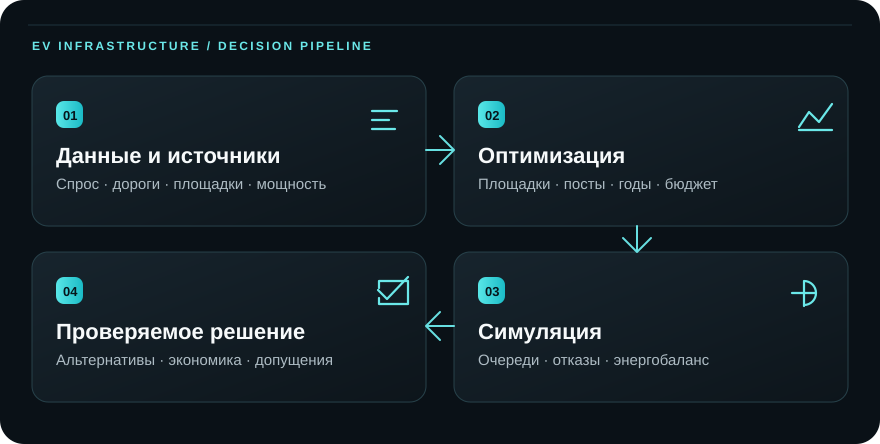

<div align="center">


# EV Infrastructure

**Система планирования зарядной инфраструктуры**

От исходных данных и ограничений сети — к вариантам строительства, проверке эксплуатации и объяснимому решению.

[Быстрый запуск](#быстрый-запуск) · [Как работает](#как-работает-система) · [Решение для комиссии](docs/commission/SOLUTION_FOR_ORGANIZERS.md) · [Документация](docs/README.md)


</div>

## Задача

**Где, когда и какую зарядную инфраструктуру строить, если бюджет, доступность площадок и мощность сети ограничены?** Система сравнивает развитие существующей сети с новыми инвестициями, рассчитывает работу выбранного плана во времени и показывает, какие данные и допущения стоят за выводом.

Это **работающий инженерный прототип**, а не готовое заключение о строительстве. Качество рекомендации определяется качеством загруженного спроса, условий подключения, стоимости и характеристик площадок. Встроенное демо использует синтетические входы; [материал для конкурсной комиссии](docs/commission/SOLUTION_FOR_ORGANIZERS.md) объясняет решение задачи, а [технический отчёт](docs/commission/REPORT.md) раскрывает эксперимент с реальными OSM-координатами и сценарными спросом, тарифами и резервом электросети.

## Как работает система

<div align="center">

</div>

| Этап | Что выполняется |
|---|---|
| **Вход** | Проверяются сценарий, география, дорожные времена, оборудование, бюджеты и ограничения подключения. Версии данных и хеши сохраняются. |
| **Планирование** | Pyomo/HiGHS выбирает площадки, посты, годы ввода, усиления узлов, накопители и локальную генерацию в пределах переданного набора кандидатов. |
| **Проверка** | SimPy отдельно моделирует прибытия, очереди, отказы в обслуживании и распределение мощности; энергетический аудит выявляет нарушения ограничений. |
| **Решение** | Доступны альтернативы по уровню обслуживания, показатели затрат и сценарной экономики, объяснение площадок и происхождение входных данных. |

В основе — **Go API и worker**, **PostgreSQL/PostGIS**, **Redis** для кэша, **Python / Pyomo / HiGHS / SimPy**, **OSRM** для дорожных времён и веб-интерфейс с **2ГИС MapGL**. Очередь и результаты хранятся в PostgreSQL; Redis не является хранилищем заданий. [OpenAPI 3.1](openapi.json) описывает публичный контракт.

## Быстрый запуск

Нужны Docker с Compose v2 и свободные локальные порты `53001` (интерфейс), `58080` (API), `8090` (вычислитель), `55432` (PostgreSQL). Команды выполняются **из корня репозитория**.

**PowerShell:**

```powershell
if (-not (Test-Path -LiteralPath .env)) { Copy-Item .env.example .env }
```

**Linux / WSL:**

```bash
test -f .env || cp .env.example .env
```

Откройте `.env` и замените `POSTGRES_PASSWORD`, `API_TOKEN`, `APP_DEMO_PASSWORD` своими значениями. `DGIS_MAPGL_API_KEY` нужен только для карты 2ГИС; без него расчёт работает. Затем в любой из двух оболочек:

```text
docker compose up -d --build
docker compose ps
```

Откройте **[localhost:53001](http://localhost:53001)** и войдите с `APP_DEMO_PASSWORD`. Сервис `migrate` применяет миграции перед запуском API. `.env` исключён из Git. Если PostgreSQL volume создан раньше с другим паролем, изменение `.env` **не меняет** пароль уже инициализированной БД; см. [диагностику и восстановление](START_HERE.md). Ключ 2ГИС передаётся в браузер, поэтому ограничьте его разрешёнными доменами.

Проверка API в PowerShell — `Invoke-RestMethod http://localhost:58080/readyz`; в Linux/WSL — `curl -fsS http://localhost:58080/readyz`. Для полной инструкции по своим данным, подготовке OSRM и обновлениям есть [START_HERE.md](START_HERE.md).

## Проверка результата

В [протоколе для текущего вычислителя](docs/commission/protocol_monaco_current.json) сравниваются существующая сеть, размещение по плотности спроса и оптимизатор. У всех планов один вход и одинаковые потоки прибытий. Прогон на **30 новых seed 20001–20030** дал в 2028 году **98,55%** обслуженной энергии у оптимизатора против **93,21%** у эвристики: разница **+5,33 п.п.**, модельный 95% интервал **+4,69…+6,01 п.п.** Дополнительные инвестиции — **1,5 млн ₽**; сценарный NPV у эвристики оказался выше. Это компромисс между доступностью и затратами, а не безусловное превосходство плана.

Результат и проверка допущений: [технический отчёт](docs/commission/REPORT.md), [машинный JSON закреплённой версии](docs/commission/benchmark_monaco_current.json), [протокол](docs/commission/protocol_monaco_current.json) и [его lock](docs/commission/protocol_monaco_current.lock.json). [Предыдущий прогон](docs/commission/benchmark_monaco_holdout.json) остаётся архивным. **Новые seed не заменяют проверку на реальном отложенном периоде.** Интервал описывает случайность симулятора, а не достоверность сценарного спроса или резерва сети. После изменения исходников вычислителя прежний протокол остаётся историческим доказательством и не описывает автоматически текущий HEAD.

Повторный расчёт записывайте в `data/` — сохранённый результат в `docs/commission/` останется нетронутым. Сначала соберите образ:

```text
docker compose build engine
```

**PowerShell:**

```powershell
$repo = (Get-Location).Path.Replace('\', '/')
New-Item -ItemType Directory -Force data/benchmark | Out-Null
docker compose run --rm --no-deps -u 0:0 -v "${repo}:/workspace" -w /workspace/engine engine `
  python -m energy.benchmark `
  --input /workspace/examples/commission_monaco.json `
  --protocol /workspace/docs/commission/protocol_monaco_current.json `
  --protocol-lock /workspace/docs/commission/protocol_monaco_current.lock.json `
  --output /workspace/data/benchmark/current_rerun.json
```

**Linux / WSL:**

```bash
mkdir -p data/benchmark
docker compose run --rm --no-deps -u "$(id -u):$(id -g)" -v "${PWD}:/workspace" -w /workspace/engine engine \
  python -m energy.benchmark \
  --input /workspace/examples/commission_monaco.json \
  --protocol /workspace/docs/commission/protocol_monaco_current.json \
  --protocol-lock /workspace/docs/commission/protocol_monaco_current.lock.json \
  --output /workspace/data/benchmark/current_rerun.json
```

Протокол сверяет хеш входа и исходников вычислителя, бюджеты, сценарии, дни и seed **до** решения задачи. Если после изменения кода повторный запуск отклоняется, это ожидаемая защита от незаметной подмены эксперимента; для точного повтора используйте указанный в отчёте commit и соответствующий образ. `data/` исключён из Git.

## Свои данные и границы применимости

В интерфейсе можно загрузить полный `PlanningInput` JSON. Через Go API доступны версии GeoJSON, CSV выполненных зарядных сессий и почасового сетевого резерва. Маршруты машин и стоянки можно преобразовать в **потенциальные** заявки на публичную зарядку и сохранить вместе с исходным вводом; происхождение, хеш и код преобразования фиксируются. [Порядок подготовки данных](START_HERE.md) · [загрузка CSV](docs/DIRECT_UPLOAD.md) · [спрос из маршрутов](docs/MOBILITY_DEMAND.md) · [интерпретация наблюдений](docs/REAL_DATA_CALCULATION.md).

| Вход или вывод | Текущее ограничение |
|---|---|
| **Спрос** | История успешных зарядок не показывает тех, кто не смог зарядиться. Расчёт из поездок даёт потенциальную потребность только для предоставленных маршрутов и весов; их репрезентативность и прогноз на реальной отложенной истории пока не проверены. |
| **Электросеть** | Проверяются пределы подключения и общего узла. Полный AC-расчёт напряжений и потоков мощности не реализован. |
| **География** | Результат `optimal` относится к загруженным площадкам и указанной временной сетке, а не ко всем возможным местам в регионе. |
| **Эксплуатация** | Многодневная симуляция повторяет один суточный профиль; годовая сезонная надёжность этим не подтверждается. |
| **Доступ** | Общий пароль демо и один серверный API-токен пока не дают многопользовательского разграничения ролей. Не загружайте конфиденциальные наборы в общее окружение. |

Пометка `observed` в пользовательских данных — **заявление поставщика**, а не независимая проверка первоисточника. Тарифы и доступную мощность для реального проекта необходимо получить у владельцев данных. [Фактический статус реализации](docs/IMPLEMENTATION_STATUS.md) отделяет работающие функции от следующих этапов.

## Документация

| Задача | Документ |
|---|---|
| Развернуть, проверить здоровье сервисов, загрузить данные | [START_HERE.md](START_HERE.md) |
| Понять публичный API и параметры запуска | [OpenAPI](openapi.json) · [RunSpec](docs/RUN_SPEC.md) |
| Рассчитать спрос из маршрутов и сохранить исходник | [Спрос из поездок](docs/MOBILITY_DEMAND.md) · [Эксплуатационная приёмка](docs/SERVICE_ACCEPTANCE.md) |
| Согласовать интерфейс с фактическим бэкендом | [Передача фронтенду](docs/frontend/BACKEND_HANDOFF.md) |
| Изучить архитектуру и дальнейшие критерии готовности | [Архитектура](docs/ARCHITECTURE.md) · [Статус](docs/IMPLEMENTATION_STATUS.md) · [Roadmap](docs/ROADMAP.md) |
| Объяснить комиссии решение задачи и проверить цифры | [Материал для организаторов](docs/commission/SOLUTION_FOR_ORGANIZERS.md) · [Технический отчёт](docs/commission/REPORT.md) |
| Найти все руководства и актуальный контракт | [Каталог документации](docs/README.md) |

Географические данные конкурсного кейса: [Geofabrik Monaco](https://download.geofabrik.de/europe/monaco.html), © OpenStreetMap contributors, [ODbL 1.0](https://www.openstreetmap.org/copyright). Лицензия исходного кода репозитория отдельно не объявлена.
