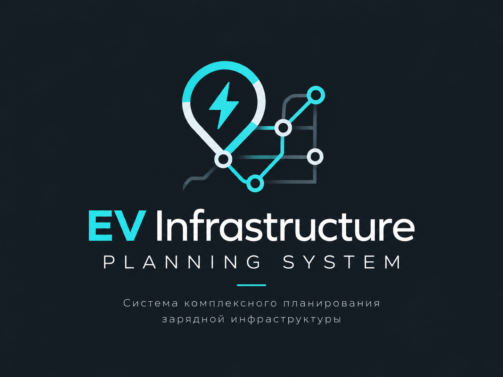

<div align="center">


<br>

  
  
  
  
  
  
  
  
  

<br>

# EV Infrastructure Planning System

Планирование зарядной сети с проверяемыми ограничениями бюджета, дорожной доступности и мощности подключения.



</div>

## Что работает сейчас

Go API сохраняет версии сценариев и загруженных данных в PostgreSQL/PostGIS, запускает расчёты через надёжную очередь в БД и отдаёт результаты. Python-движок на Pyomo/HiGHS выбирает площадки, оборудование, годы ввода, усиления узлов, накопители и PV в рамках заданных входов. SimPy независимо проверяет прибытия, очереди, общую мощность, диспетчеризацию энергии и перенос состояния накопителя между днями. В результате доступны альтернативные пороги обслуживания, экономика по заданным тарифам, объяснение выбранных объектов и физический аудит. Redis ускоряет географические ответы; потеря Redis не уничтожает задачи.

Интерфейс показывает основной план, альтернативы, происхождение данных, энергетический аудит и дневную работу сети. Карта использует 2ГИС MapGL при наличии ключа. Пользователь может загрузить полный `PlanningInput` JSON через интерфейс; нормализованные GeoJSON и CSV зарядных сессий/сетевого резерва загружаются через Go API. OpenAPI: [openapi.json](openapi.json), фактический контракт для фронтенда: [BACKEND_HANDOFF.md](docs/frontend/BACKEND_HANDOFF.md).

**Достоверность входов — отдельный вопрос.** Встроенное демо полностью синтетическое. [Конкурсный кейс Монако](docs/commission/REPORT.md) содержит реальные OSM-точки и времена автомобильных маршрутов по OSRM, но спрос, цены, оборудование и доступная мощность являются сценарными допущениями. Поэтому его численные рекомендации не являются подтверждённым планом строительства. Расчёт на данных оператора возможен после загрузки и проверки этих данных; метка `observed` отражает заявление поставщика, не независимую сертификацию.

## Быстрый запуск

Нужны Docker Desktop/Engine с Compose v2 и свободные локальные порты `53001`, `58080`, `8090`, `55432`. Из корня репозитория:

```powershell
Copy-Item .env.example .env
# В .env задайте POSTGRES_PASSWORD, API_TOKEN, APP_DEMO_PASSWORD.
# DGIS_MAPGL_API_KEY нужен только для карты 2ГИС.
docker compose up -d --build
docker compose ps
```

В Linux/WSL замените `Copy-Item` на `cp`. Откройте [http://localhost:53001](http://localhost:53001) и введите `APP_DEMO_PASSWORD`. Миграции применяются сервисом `migrate` до запуска API. Файл `.env` не коммитится. Если пароль существующего PostgreSQL volume уже другой, изменение `.env` само по себе его не меняет. Подробная инструкция, загрузка данных и диагностика: [START_HERE.md](START_HERE.md).

Для API нужны bearer-токен `API_TOKEN` и [описанные маршруты](openapi.json). Для карты ключ 2ГИС передаётся браузеру и должен иметь ограничение по доменам; это не серверный секрет. Без ключа расчёт работает, карта показывает состояние подключения. Для локального OSRM сначала подготовьте граф в `data/osrm/` по [инструкции](START_HERE.md), затем запустите `docker compose --profile routing up -d osrm`.

## Проверка и воспроизведение кейса

Код эксперимента: [benchmark.py](engine/energy/benchmark.py). Он сравнивает существующую сеть, простое размещение по плотности достижимого спроса и MILP на **одном входе**. Для всех планов используются одни и те же 30 потоков прибытий; результаты SimPy включают физический аудит, парные интервалы, отказ наиболее загруженного объекта, изменение спроса и сетевого резерва на ±25%. Отчёт не выдаёт интервалы модельной случайности за доверие к предположениям о спросе.

```powershell
docker compose build engine
docker run --rm -v E:/energy:/workspace -w /workspace/engine energy-engine `
  python -m energy.benchmark `
  --input /workspace/examples/commission_monaco.json `
  --output /workspace/docs/commission/benchmark_monaco.json `
  --year 2028 --scenario базовый --seeds 30
```

В WSL используйте монтирование `/mnt/e/energy:/workspace`. Сохранённый вход: [commission_monaco.json](examples/commission_monaco.json), [итог и границы применимости](docs/commission/REPORT.md). Для повторного создания географии из закреплённого OSM-экстракта и OSRM см. отчёт; там указаны SHA-256, источник и лицензия.

CI выполняет Go unit/integration/race, Python pytest, проверку OpenAPI, frontend lint/typecheck/build, сквозные smoke-тесты и Playwright. Локально для изменения вычислительного ядра:

```powershell
docker run --rm -v E:/energy/engine:/app -w /app energy-engine python -m pytest -q
```

## Границы реализации

- Нет автоматического получения подтверждённого спроса, цен и условий техприсоединения для произвольного города; они должны поступить от владельцев данных и пройти предметную проверку. История выполненных зарядок не раскрывает скрытый неудовлетворённый спрос.
- Проверяются ограничения подключения и общего узла; расчёт напряжений и потоков в полной AC-схеме электросети не реализован.
- Модель зарядки транспорта и коридорный анализ доступны отдельными расчётными модулями, но не как единый сквозной инвестиционный оптимизатор для всех сегментов.
- Посуточная симуляция повторяет один заданный суточный профиль (до 14 последовательных дней); сезон, день недели, длительные отказы и годовая надёжность не подтверждены.
- Альтернативы — отдельные решения с заданным минимальным обслуживанием, а не доказанный полный фронт Парето. Автоматического цикла «симуляция → новое ограничение → пересчёт» нет.
- Демо-вход защищён одним паролем, API — одним bearer-токеном. Многопользовательские проекты/RBAC и production-аутентификация пока отсутствуют.

Подробный текущий статус: [IMPLEMENTATION_STATUS.md](docs/IMPLEMENTATION_STATUS.md). Для защиты и передачи комиссии используйте [конкурсный отчёт](docs/commission/REPORT.md), включая перечень данных, которые ещё необходимо подтвердить.

Параметры расчёта теперь можно сохранять отдельно от сценария через [RunSpec](docs/RUN_SPEC.md): число seed, дни симуляции, лимит solver, альтернативы и объяснения. Режим validation пока не означает приёмку плана по эксплуатационным требованиям.

План следующих работ: [доведение системы и алгоритма до проверяемой готовности](docs/SYSTEM_COMPLETION_PLAN.md). В нём разделены доработка спроса и эксплуатации, инвестиционная модель, доказательство эффекта и надёжность бэкенда; у каждого этапа есть критерий завершения.

Исходные геоданные кейса получены из [Geofabrik Monaco](https://download.geofabrik.de/europe/monaco.html), © OpenStreetMap contributors, [ODbL 1.0](https://www.openstreetmap.org/copyright). Лицензия исходного кода этого репозитория отдельно не объявлена.
