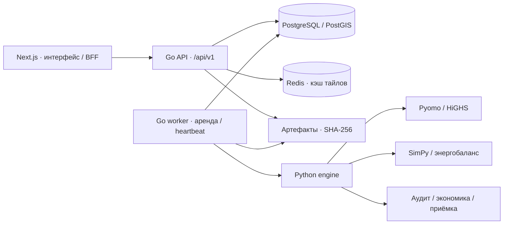

<p align="center">
  
</p>

<p align="center">
  <a href="START_HERE.md">Запуск</a> ·
  <a href="docs/ARCHITECTURE.md">Архитектура</a> ·
  <a href="openapi.json">API</a> ·
  <a href="docs/commission/REPORT.md">Эксперимент</a> ·
  <a href="docs/commission/TASK_FIT_AUDIT.md">Аудит конкурсного ТЗ</a>
</p>

# Энергоконтур

**Инженерная система планирования зарядной инфраструктуры.** Она выбирает площадки, комплекты оборудования и годы строительства с учётом спроса, дорожной доступности, бюджетов и ограничений энергоснабжения. Затем проверяет выбранную сеть в отдельной модели эксплуатации и показывает экономику, очереди и причины выбора.

Проект разработан для задачи № 03 «Зарядка электромобилей в мегаполисах» ООО «Росатом Сеть зарядных станций». Его текущий результат — **проверяемый сценарный план**, который можно воспроизвести и сравнить с другими вариантами. Подтверждённая инвестиционная рекомендация для конкретного города требует данных оператора и сетевой организации.

<p align="center">
  
</p>

<details>
<summary>Открыть снимки интерфейса в исходном размере</summary>

[Десктоп, 1440 × 960](docs/assets/interface/desktop.png) · [Телефон, 390 × 844](docs/assets/interface/mobile.png) · [Сводка на телефоне после прокрутки](docs/assets/interface/mobile-result.png).

Снимки сделаны 1 октября 2026 года в работающем приложении. На них загружен Monaco-кейс: география публичная, спрос, цены и резерв сети предположены. Экран показывает 2027 год и три прогона конкретного расчёта; эксперимент ниже оценивает 2028 год на 30 seed. Показатель 100% на экране относится к оптимизатору, а не к гарантированному результату эксплуатации.

</details>

## Какую проблему решаем

Удачное расположение станции ещё не означает удачную инвестицию. Площадка может быть востребована, но ограничена мощностью подключения; дешёвый вариант — создавать очереди; дорогой — обслуживать больше пользователей, но иметь меньшую загрузку оборудования. Решение должно учитывать эти зависимости вместе.

Вместо ручного выбора по карте система рассчитывает **сеть целиком в заданной области поиска**:

| Вопрос | Что выдаёт система |
|---|---|
| Где строить? | Выбранные площадки из переданного набора, дорожная доступность зон и объяснение решения |
| Что установить? | Комплект зарядных постов из каталога допустимых вариантов площадки |
| Когда инвестировать? | Годы строительства, ежегодный CAPEX и график усиления сети с отдельными сроками оплаты и ввода |
| Как обеспечить энергией? | Потребление в пределах станции и общего узла, выбор усиления, накопителя и локальной генерации |
| Как сеть будет работать? | Обслуженная энергия, очередь, отказы, загрузка станций, распределение нагрузки и энергобаланс |
| Что изменится при росте спроса? | Общий инвестиционный план для нескольких сценариев и отдельная эксплуатация в каждом |
| Как оценить решение? | Сравнение альтернатив, NPV по заданным ценам, сервисная приёмка, чувствительность и экспорт исходников расчёта |

**География не зашита в алгоритм.** Территория, кандидаты, дороги, часовой пояс, тарифы и параметры транспорта задаются входом. Реальная география сама по себе не делает предположенный спрос наблюдаемым.

## Как мы реализовали решение

<p align="center">
  
</p>

### 1. Сначала фиксируем вход

Система принимает полный `PlanningInput` JSON или собирает сценарий из выбранных версий нормализованных слоёв. CSV с зарядными сессиями и сетевым резервом, GeoJSON, маршруты со стоянками и датированные заявки имеют отдельные адаптеры. GTFS импортируется CLI вместе с операционными параметрами парка.

Проверяются координаты, единицы, ссылки между объектами, дубли и полнота временного покрытия. Неизвестная мощность или энергия не заменяется нулём. PostgreSQL хранит неизменяемый снимок; исходники датированного спроса и поездок могут храниться в контролируемых артефактах с SHA-256.

Происхождение видно в интерфейсе и результате:

| Метка | Смысл |
|---|---|
| `observed` | Поставщик заявил данные наблюдёнными; независимая проверка источника не подразумевается |
| `derived` | Значение получено преобразованием исходного набора |
| `assumed` | Введённое сценарное предположение |

Выполненные зарядные сессии описывают состоявшийся отпуск энергии. Для потенциального спроса используется отдельная модель поездок, стоянок, домашней зарядки и батареи. Она рассчитывает потребность для предоставленной выборки, а не восстанавливает автоматически все поездки города. ML-прогноз без независимой истории не заявляется.

### 2. Выбираем инвестиции совместно с энергоснабжением

**Python + Pyomo + HiGHS** решают смешанно-целочисленную задачу. Инвестиционные переменные задают площадку, комплект постов, год ввода, усиление узла, ёмкость накопителя и мощность генерации. Операционные переменные распределяют энергию по достижимым площадкам, времени и сценариям.

Модель соблюдает ежегодный и общий бюджет, сроки доступности площадки и усиления, закреплённые решения, допустимые варианты оборудования, лимиты станции и общих узлов. Установленная мощность постов, договорный предел подключения и фактическое потребление учитываются отдельно. Накопитель имеет баланс энергии, SoC, КПД, ограничения мощности и запрет одновременного заряда/разряда.

- **Город:** максимизировать обслуженную энергию; вторичные критерии учитывают инвестиции и дорожную доступность.
- **Оператор:** максимизировать сценарный NPV; допустим результат без нового строительства.
- **Риски:** ожидание, худший из заданных сценариев или ограничение CVaR при указанных вероятностях.
- **Альтернативы:** повторное решение при разных требованиях обслуживания; полный доказанный фронт Парето не заявляется.

Инвестиции общие для сценариев будущего: модель не выбирает сегодняшнее строительство, зная заранее, какой сценарий наступит. `optimal` относится к предоставленным кандидатам и временной сетке, а не ко всем возможным местам города.

### 3. Отдельно проверяем эксплуатацию

**SimPy** моделирует прибытия и выбор станции, очередь, ограничение времени зарядки, отказ и ремонт, разделение мощности и переезд к соседней станции при наличии дорожной связи. Симулятор не принимает назначения оптимизатора как гарантированное поведение пользователей.

Датированные заявки сохраняют прибытие, дедлайн, энергию, SoC и предел мощности; календарь учитывает IANA-пояс и переходы времени. Минутная диспетчеризация проверяет энергию и переносит состояние накопителя через границы суток. Режим средних 24-часовых профилей сохраняется как явная совместимость. Короткий период не выдаётся за проверенный сезонный год.

Состояние задачи, допустимость MILP и выполнение требований сервиса разделены: `succeeded` / `optimal` / `accepted` отвечают на разные вопросы. `RunSpec v2` отделяет seed разработки от итоговой проверки и допускает ограниченный поиск улучшения. Успешный решатель сам по себе не подтверждает качество обслуживания.

### 4. Возвращаем план, который можно разобрать

Интерфейс содержит территорию и инспектор площадок, эксплуатацию по дням, энергетический аудит, экономику, сравнение альтернатив и происхождение данных. Доступны контрфактический расчёт без выбранной площадки и JSON-экспорт. Недоступность подложки 2ГИС не останавливает расчёт и просмотр таблиц.

Парк и коридор имеют отдельные вычислительные модели: зарядное расписание по рейсам и SoC; достижимость цепочки станций и последствия отказа. **Парк пока не включён в общий городской инвестиционный MILP**, а действующая станция фиксируется существующим комплектом: произвольное расширение и смешанные типы постов в одном объекте ещё требуют развития.

## Что показала проверка

Закреплённый кейс использует координаты OpenStreetMap в Monaco и дорожную матрицу OSRM. Спрос, сетевой резерв и рублёвые цены — сценарные предположения. Это компактный воспроизводимый регрессионный пример, а не подтверждённый российский городской пилот.

На одном входе и при общем пределе бюджета 10 млн ₽ сравнили существующую сеть, размещение по плотности и оптимизатор. Для каждого плана использовали одинаковые внешние потоки, 30 seed, трёхсуточные прогоны, отказ станции и изменение спроса/сетевого резерва. Повтор 1 октября не меняет протокол, код модели или старые результаты.

| Базовый сценарий, 2028 год | Существующая сеть | По плотности | Энергоконтур |
|---|---:|---:|---:|
| Обслуженная доля энергии | 33,04% | 93,29% | **98,57%** |
| Отпущенная энергия, кВт·ч/сутки | 534,34 | 1 514,40 | **1 600,73** |
| Среднее по seed p95 ожидания, мин | 38,50 | 27,64 | **14,77** |
| Новый CAPEX, млн ₽ | 0 | **3,70** | 5,20 |
| Сценарный NPV proxy, млн ₽ | 7,88 | **17,54** | 17,03 |
| Отпуск / установленная энергия за сутки | **50,60%** | 30,34% | 23,48% |

Парная разность обслуживания «оптимизатор − плотность»: **+5,28 п.п.**, bootstrap-интервал 95% **[4,88; 5,67] п.п.** Этот интервал описывает случайность данной модели, не точность исходного спроса.

**Вывод:** решение обслуживает больше энергии и сокращает очередь, но требует больше инвестиций. Эксперимент не доказывает одновременное снижение CAPEX, повышение относительной загрузки оборудования и превосходство NPV. Поэтому цель из конкурсного ТЗ покрыта работающим расчётным инструментом, однако полное подтверждение эффекта для города ещё предстоит.

[Методика, хеши и воспроизведение](docs/commission/REPORT.md) · [JSON результата](docs/evidence/task-fit-2026-10-01/benchmark_monaco.json) · [Аудит требований организаторов](docs/commission/TASK_FIT_AUDIT.md)

## Архитектура



| Слой | Реализация и граница |
|---|---|
| Пользовательский API | Go 1.26; handler → planning/geography use case → адаптеры хранения, кэша и engine |
| Долговечные данные | PostgreSQL 18 + PostGIS 3.6; миграции с checksum, индексы списков/очереди и пространственных запросов |
| Выполнение | PostgreSQL-очередь, lease, heartbeat и идентификатор попытки; публикация результата защищена от устаревшего worker |
| Вычисления | Python 3.13 в контейнере; FastAPI/Pydantic — внутренний HTTP/JSON-контракт, Pyomo/HiGHS — MILP, SimPy — эксплуатация |
| Карта | 2ГИС MapGL; серверная конфигурация ключа, GeoJSON и MVT из PostGIS |
| Интерфейс | Next.js 16 / React 19, локальные IBM Plex Sans и Manrope, адаптивное монохромное рабочее пространство |

Redis ускоряет выдачу тайлов; задачи и результаты сохраняются без него. Python не получает доступ к пользовательской БД или произвольным URL. Секрет Go API остаётся на сервере BFF.

## Запуск

Нужны Git и Docker с Compose. Команды выполняются **из корня репозитория**.

```sh
cp .env.example .env
# Задайте секреты в .env, затем:
docker compose up -d --build
docker compose ps
```

Для PowerShell первая команда: `Copy-Item .env.example .env`. Существующий `.env` не перезаписывайте.

| Переменная | Назначение |
|---|---|
| `POSTGRES_PASSWORD` | Пароль локальной PostgreSQL |
| `API_TOKEN` | Серверный bearer token Go API |
| `APP_ACCESS_PASSWORD` | Пароль входа в интерфейс экземпляра |
| `SESSION_SECRET` | Независимый ключ подписи пользовательской сессии |
| `DGIS_MAPGL_API_KEY` | Веб-ключ 2ГИС; ограничьте разрешённые домены у поставщика |
| `DGIS_MAP_STYLE_ID` | Необязательный стиль карты |

Откройте **[localhost:53001](http://localhost:53001)**. Readiness API: [localhost:58080/readyz](http://localhost:58080/readyz). Одноразовый `migrate` должен завершиться с кодом 0; API и worker запускаются после него.

Первый запуск открывает пустое рабочее пространство. Добавьте свой JSON в **Данные → Сценарий** или выберите версии GeoJSON. Для знакомства можно явно импортировать [сценарный пример Monaco](examples/commission_monaco.json), затем запустить расчёт в планировании. Пример не подставляется автоматически и не является реальными данными оператора.

Подробно: **[START_HERE.md](START_HERE.md)** — `.env`, Docker, источники, OSRM и первый расчёт. Для закрытого развёртывания одной организации используется **[отдельный production-профиль](docs/PRODUCTION.md)** с HTTPS, owner/runtime ролями БД и offline backup/recovery. Общего пароля недостаточно для публичного сервиса: проекты и RBAC ещё не реализованы.

## Проверка и границы готовности

Проверка 1 октября 2026 года: **266 Python-тестов**, Go `-count=1 -race -tags=integration` с PostGIS и engine, 8 runtime-тестов фронтенда, lint, TypeScript, production build и сквозные браузерные проверки. Команды, область покрытия, снимки и хеши — в [протоколе текущей проверки](docs/evidence/task-fit-2026-10-01/VERIFICATION.md). Это локальная проверка рабочего дерева; новый remote CI и release tag не объявляются.

До подтверждённого городского решения остаются: независимая история спроса и условия подключения; совместная модель публичной сети и парков; более детальная инвестиционная сетка и расширение активов; сезонный горизонт; проверка напряжений/линий при наличии схемы сети; испытания масштаба и сравнение затрат при одинаковом сервисе. Лимиты узла сейчас проверяются, **AC power-flow не реализован**. Крупные результаты ещё хранятся в БД; S3 и принудительное завершение отдельного solver-процесса при отмене — дальнейшая работа.

## Техническая документация

| Задача | Документ |
|---|---|
| Архитектура, данные, надёжность и ограничения | [Архитектура](docs/ARCHITECTURE.md) · [Матрица возможностей](docs/IMPLEMENTATION_STATUS.md) |
| API и согласование с фронтендом | [OpenAPI 3.1](openapi.json) · [Backend handoff](docs/frontend/BACKEND_HANDOFF.md) · [UI и состояния](docs/frontend/ENGINEERING_UI_IMPLEMENTATION.md) |
| Импорты, спрос и календарь | [CSV](docs/DIRECT_UPLOAD.md) · [GeoJSON](docs/DATASET_SCENARIOS.md) · [Поездки](docs/MOBILITY_DEMAND.md) · [Датированные заявки](docs/DATED_DEMAND.md) |
| Запуск, приёмка и альтернативы | [RunSpec](docs/RUN_SPEC.md) · [Service acceptance](docs/SERVICE_ACCEPTANCE.md) · [Альтернативы](docs/ALTERNATIVES_MODEL.md) |
| Эксплуатация и восстановление | [Runbook](docs/RUNBOOK.md) · [Закрытое развёртывание](docs/PRODUCTION.md) |
| Конкурсная подача и независимый вывод | [Решение для организаторов](docs/commission/SOLUTION_FOR_ORGANIZERS.md) · [Аудит ТЗ](docs/commission/TASK_FIT_AUDIT.md) · [Эксперимент](docs/commission/REPORT.md) |

Полный [каталог документации](docs/README.md) разделяет контракты, эксплуатационные инструкции и неизменяемые доказательства. Старые промомакеты и дубли не входят в действующую документацию.

География Monaco: © OpenStreetMap contributors, [ODbL 1.0](https://www.openstreetmap.org/copyright), [Geofabrik](https://download.geofabrik.de/europe/monaco.html). Условия каждого другого источника сохраняются в его манифесте. Лицензии локальных шрифтов — в [каталоге шрифтов](frontend/src/app/fonts/README.md). Лицензия исходного кода отдельно не объявлена.
