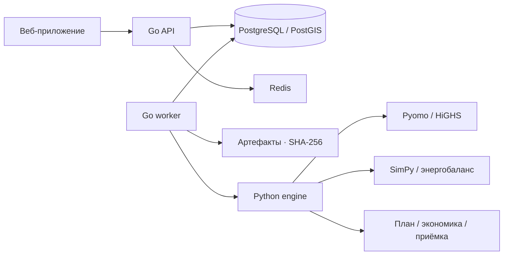

<p align="center">
  
</p>

<h1 align="center">Энергоконтур</h1>
<p align="center"><strong>Планирование зарядной инфраструктуры</strong></p>

<p align="center">
  <a href="#решение-задачи-конкурса">Решение задачи</a> ·
  <a href="#как-работает-программа">Программа</a> ·
  <a href="#технологии">Технологии</a> ·
  <a href="#запуск">Запуск</a> ·
  <a href="docs/README.md">Документация</a>
</p>

**Энергоконтур** — инженерное веб-приложение для города и оператора зарядной сети. Оно рассчитывает, где разместить станции, какое оборудование установить, когда инвестировать и как обеспечить зарядку в пределах доступной мощности. Рекомендации проходят отдельную проверку эксплуатации: с очередями, изменением спроса и отказами оборудования.

<p align="center">
  
</p>

<p align="center">
  <a href="docs/assets/interface-desktop.png">Десктоп</a> ·
  <a href="docs/assets/interface-mobile.png">Мобильная версия</a>
</p>

## Решение задачи конкурса

Проект разработан для **задачи № 03 «Зарядка электромобилей в мегаполисах»** ООО «Росатом Сеть зарядных станций».

Организаторы обозначили системную проблему: выбор площадок часто опирается на локальные оценки, тогда как эффективность сети определяется сразу транспортным спросом, доступной энергией, инвестициями и будущим ростом электротранспорта. Ошибка в одном из этих факторов приводит к очередям, недозагрузке оборудования или дорогому усилению электросети.

**Наше решение — совместная модель инфраструктуры и энергоснабжения, связанная с независимой симуляцией работы сети.** Площадка оценивается в составе всей сети: какую потребность она обслужит, какой ресурс потребует и что произойдёт при изменении условий.

| Задача организаторов | Как она решена в Энергоконтуре |
|---|---|
| Учитывать транспортный спрос | Зоны, поездки, стоянки, домашняя зарядка, батареи и датированные зарядные заявки формируют потребность в публичной энергии |
| Выбирать площадки системно | Оптимизатор сопоставляет доступные кандидаты, дорожные времена, оборудование, существующие станции и инвестиционные ограничения |
| Согласовать зарядки с электросетью | Модель проверяет подключения и общие узлы, рассчитывает усиление, накопители и локальную генерацию |
| Планировать развитие на несколько лет | Инвестиции распределяются по годам; решение проверяется на нескольких сценариях роста и доступной мощности |
| Снизить очереди и повысить доступность | Отдельный симулятор воспроизводит прибытия, выбор станции, разделение мощности, ожидание, переезды и отказы |
| Учесть общественный транспорт | Специализированный модуль рассчитывает зарядные окна, рейсы и SoC парка; коридорный модуль проверяет достижимость маршрута |
| Обосновать вложения | CAPEX, OPEX, NPV, сервисные показатели и альтернативы позволяют сравнить варианты на одинаковых входах |

Городской режим нацелен на обслуживание спроса и доступность при ограниченном бюджете. Режим оператора оценивает экономику развития с заданными требованиями сервиса. Территория, тарифы и параметры транспорта задаются данными пользователя.

## Как работает программа

**1. Подготовка данных.** Пользователь загружает готовый сценарий или собирает его из версий географических слоёв, зарядных сессий, сетевых условий и транспортных данных. Проверяются единицы, координаты, временное покрытие и связи объектов. Источники, допущения и SHA-256 сохраняются вместе с расчётом.

**2. Совместный выбор инвестиций.** Pyomo формирует смешанно-целочисленную модель, HiGHS выбирает площадки, комплекты постов и сроки строительства. Ограничения бюджета, подключения, общего сетевого узла, накопителя и генерации действуют одновременно. Инвестиции общие для сценариев будущего; эксплуатация может различаться.

**3. Независимая проверка работы.** SimPy моделирует поток транспорта и поведение станции во времени. Минутный энергетический dispatch учитывает мощность оборудования, общий резерв, генерацию и состояние накопителя. Симулятор выбирает станции по своим правилам, не принимая назначения оптимизатора за гарантированное поведение.

**4. Проверка требований сервиса.** Выполнение задания, допустимость математической модели и качество эксплуатации имеют отдельные статусы. Система оценивает обслуживание, отказы и ожидание; при заданных требованиях возвращает `accepted`, `rejected` или `inconclusive`. Ограниченный поиск улучшений использует отдельные seed разработки.

**5. Инвестиционный план.** Интерфейс показывает выбранные площадки, график вложений, работу станций, энергобаланс, экономику и сравнение альтернатив. Параметры можно изменить и пересчитать; вход и результат доступны для экспорта и воспроизведения.

### Что получает пользователь

- **План сети:** площадки, комплекты зарядного оборудования, годы ввода и потребность в энергоснабжении.
- **Проверку эксплуатации:** обслуженная энергия, очереди, отказы, загрузка, работа накопителей и последствия изменения спроса.
- **Обоснование решения:** стоимость, сценарная экономика, причины выбора площадки и варианты при других требованиях.
- **Воспроизводимый расчёт:** версии входов, параметры модели, seed, хеши, статус решателя и проверки ограничений.

## Проверка решений

Мы сравнили размещение по плотности спроса и оптимизатор на одинаковом входе, при одном пределе бюджета и одинаковых внешних потоках. Независимая эксплуатационная проверка включает **30 seed** и сценарии отказов.

| Показатель | По плотности спроса | Энергоконтур |
|---|---:|---:|
| Обслуженная энергия | 93,29% | **98,57%** |
| Средний по seed p95 ожидания | 27,64 мин | **14,77 мин** |
| Отказы за 3 суток | 10,00 | **2,33** |
| CAPEX новых объектов | 3,70 млн ₽ | 5,20 млн ₽ |

Прирост обслуживания — **5,28 процентного пункта**, парный 95%-интервал: **4,88–5,67 п.п.** Результат показывает измеримый компромисс: дополнительные вложения обеспечили больше обслуженной энергии и меньше ожидания. Пользователь видит этот компромисс и может выбрать другую допустимую альтернативу.

Это воспроизводимое модельное сравнение с предположенными спросом, ценами и сетевым резервом. [Методика, входы и результаты](docs/commission/REPORT.md) содержат источники, ограничения и команды повтора.

Основная расчётная цепочка уже работает сквозным образом — от пользовательской загрузки до сохранённого плана и проверки эксплуатации. Для городского пилота подключаются подтверждённые данные оператора и сетевой организации. Объединение парков с публичной инвестиционной моделью, детальное расширение активов и AC-проверка сети выделены в [технической матрице](docs/IMPLEMENTATION_STATUS.md); действующий парк рассчитывается отдельным модулем.

## Технологии

<p>
  <a href="https://go.dev/"></a>
  <a href="https://www.postgresql.org/"></a>
  <a href="https://redis.io/"></a>
  <a href="https://www.docker.com/"></a>
</p>
<p>
  <a href="https://www.python.org/"></a>
  <a href="https://fastapi.tiangolo.com/"></a>
  <a href="https://highs.dev/"></a>
  <a href="https://simpy.readthedocs.io/"></a>
</p>
<p>
  <a href="https://nextjs.org/"></a>
  <a href="https://react.dev/"></a>
  <a href="https://www.typescriptlang.org/"></a>
  <a href="https://docs.2gis.com/en/mapgl/overview"></a>
</p>



Go отвечает за API, сохранение данных и жизненный цикл задач. PostgreSQL — источник долговечных данных; Redis ускоряет выдачу географических тайлов. Python изолирует математические модели и решатель. Next.js предоставляет рабочий интерфейс и серверный доступ к API; карта отображается через 2ГИС.

Очередь использует аренду, heartbeat и защиту от устаревших попыток. Контролируемые артефакты проверяются по SHA-256; секрет API остаётся на сервере. Контракт `/api/v1` описан в OpenAPI 3.1.

## Запуск

Из корня репозитория, с установленным Docker Compose:

```sh
test -f .env || cp .env.example .env
# Задайте секреты в .env, затем:
docker compose up -d --build
docker compose ps
```

В PowerShell первая команда: `if (-not (Test-Path .env)) { Copy-Item .env.example .env }`.

В `.env` задайте `POSTGRES_PASSWORD`, `API_TOKEN`, `APP_ACCESS_PASSWORD`, `SESSION_SECRET` и ключ карты `DGIS_MAPGL_API_KEY`. Откройте **[localhost:53001](http://localhost:53001)**, загрузите данные и запустите расчёт. Первый запуск открывает пустое рабочее пространство; примеры не подставляются автоматически.

[Пошаговый запуск](START_HERE.md) описывает окружение, импорт и первый результат. [Production-профиль](docs/PRODUCTION.md) предназначен для закрытого экземпляра одной организации: HTTPS, разделение ролей БД и резервное восстановление. Публичный многопользовательский доступ требует отдельного разграничения проектов и ролей.

## Документация и проверка

| Раздел | Материал |
|---|---|
| Архитектура и границы модели | [Архитектура](docs/ARCHITECTURE.md) · [Матрица возможностей](docs/IMPLEMENTATION_STATUS.md) |
| API и интеграция интерфейса | [OpenAPI](openapi.json) · [Backend handoff](docs/frontend/BACKEND_HANDOFF.md) |
| Данные и спрос | [Импорт](docs/DATA_INGESTION.md) · [Поездки](docs/MOBILITY_DEMAND.md) · [Календарь и заявки](docs/DATED_DEMAND.md) |
| Выполнение и качество плана | [Расчёты, приёмка и альтернативы](docs/CALCULATIONS.md) |
| Эксплуатация | [Runbook](docs/RUNBOOK.md) · [Развёртывание](docs/PRODUCTION.md) |
| Конкурсное обоснование | [Сопоставление с ТЗ](docs/commission/TASK_FIT_AUDIT.md) · [Эксперимент](docs/commission/REPORT.md) |

**Проверки:** 266 тестов вычислительного ядра; Go race/integration с PostgreSQL и engine; 26 браузерных тестов, включая реальный импорт, очередь, расчёт и экспорт. Подробное покрытие и условия стенда — в [протоколе](docs/evidence/readme-2026-10-01/VERIFICATION.md). Математические проверки включают полный перебор малых задач, баланс энергии, SoC, бюджет и ограничения мощности.

[Каталог технической документации](docs/README.md) · [Источники оформления и лицензии](docs/assets/README.md)
