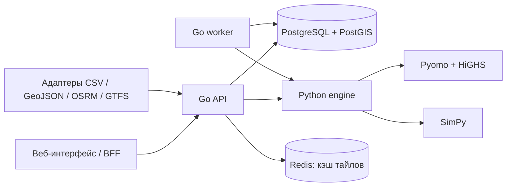

# Архитектура и границы расчёта

Этот документ описывает **действующий контур** и его ограничения. Предполагаемые расширения живут в [ROADMAP.md](ROADMAP.md). Доменная постановка и поля HTTP-запросов детализированы в [OpenAPI](../openapi.json).

## Компоненты

| Компонент | Ответственность | Источник истины |
|---|---|---|
| Go API | HTTP-контракт, валидация оболочки, сценарии, версии данных, чтение результата, постановка и отмена задач | PostgreSQL |
| Go worker | Аренда и heartbeat задачи, вызов движка, проверка ответа и публикация по идентификатору попытки | PostgreSQL |
| Python engine | Нормализация расчётного входа, модель спроса, оптимизация, аудит, симуляция, экономика и отдельные модели парка/коридора | Не хранит пользовательское состояние |
| PostgreSQL/PostGIS | Неизменяемые снимки сценариев, версии импорта, задачи, события, результаты, пространственные объекты | Долговечное хранилище |
| Redis | Кэш географических тайлов; отказ означает чтение из БД | Не участвует в надёжной очереди |
| OSRM | Воспроизводимое построение дорожной матрицы из выбранного графа | Внешний подготовительный расчёт; отсутствие пути не заменяется евклидовым расстоянием |

Схема **handler → use case (`backend/internal/planning`, `geography`) → интерфейс адаптера → SQL/Redis/Python** отделяет HTTP от доменных операций. Python не становится публичным API для браузера. В Compose `engine` опубликован на localhost лишь для локальной разработки; при внешнем размещении его следует изолировать.

## Сквозная операция

1. Пользователь загружает нормализованные версии данных или полный `PlanningInput`. Для крупных датированных заявок он может сначала загрузить JSON в контролируемый локальный артефактный store и передать в сценарии только SHA-256-манифест. Go сверяет байты перед валидацией; PostgreSQL сохраняет неизменяемый сценарий и хеш снимка.
2. `RunSpec` фиксирует конфигурацию запуска отдельно от сценария. Go транзакционно создаёт задание, его параметры и ожидаемые отпечатки. Повтор с тем же idempotency key и иным телом — конфликт.
3. Worker берёт задачу в аренду. Он передаёт движку снимок и настройки, проверяет принадлежность ответа отправленному запросу и публикует результат только для действующей попытки. Просроченная попытка не может перезаписать новую.
4. Движок выбирает инвестиции на общем горизонте и проверяет бюджет, мощность, баланс энергии и накопитель. Отдельная событийная модель оценивает эксплуатацию по seed; сервисная приёмка имеет собственный статус.
5. API отдаёт событие/состояние и результат, включая происхождение данных, статус solver, аудит, SimPy и сценарные экономические показатели. Redis не нужен для восстановления задания.

## Три разных статуса

| Слой | Пример | Что означает |
|---|---|---|
| Выполнение | `queued`, `running`, `succeeded`, `failed`, `cancelled` | Состояние процесса и публикации результата. |
| Математическая модель | `optimal`, `feasible`, `infeasible`; gap и `verification.passed` | Наличие и допустимость решения **в переданном пространстве кандидатов и дискретизации**. |
| Обслуживание | `accepted`, `rejected`, `inconclusive`, `not_evaluated` | Прохождение заданных порогов **в сценарной SimPy-проверке**, а не независимое подтверждение спроса или условий сети. |

Вывод пользователю должен сохранять эти слои отдельно. `succeeded` не равен `accepted`, а `optimal` не доказывает отсутствие очередей.

## Происхождение и воспроизводимость

Набор данных хранит источник, заявленный тип (`observed`, `derived`, `assumed`), время наблюдения при наличии, лицензию и SHA-256. Сценарий привязан к конкретным UUID версий, а запуск — к сценарию и `RunSpec`. Go сверяет снимки и ответ вычислителя до публикации. Результат содержит версии движка и отпечаток его исходников. Разные хеши могут относиться к **разным представлениям**: исходным байтам файла, нормализованному JSON, сохранённому JSONB и фактическому запросу в engine. Их нельзя сравнивать как одно поле; правила перечислены в [RUN_SPEC.md](RUN_SPEC.md).

`observed` означает, что загрузивший заявил данные наблюдёнными; система не удостоверяет первоисточник. Выполненные сессии показывают обслуженных пользователей и не раскрывают тех, кто уехал из-за очереди или отсутствия станции. Потенциальная потребность из маршрутов строится только для предоставленных маршрутов и весов. Эти ограничения должны сопровождать любой экспорт результата.

## Физические границы

- Установленная мощность постов, договорный предел площадки и доступный резерв общего узла — разные ограничения.
- Накопитель имеет баланс энергии и ограничения SoC/мощности; после оптимизации аудит пересчитывает сохранение энергии. Симуляция непрерывных суток переносит очередь и SoC через полночь. Датированные заявки сохраняют окна и 23/25-часовые дни; зоны старого профиля повторяют типовые сутки. Короткий календарь не является проверенным сезонным годом.
- Дорожная достижимость определяется выбранной матрицей; недостижимую зону нельзя сделать достижимой подстановкой расстояния по прямой.
- Полной схемы сети и AC power-flow нет. Соблюдение лимита узла — **не** заключение о напряжениях и загрузке линий.
- Отдельные модули парка и коридора существуют, но парк пока не делит инвестиции/посты с публичной сетью в едином оптимизационном решении.

## Операционные и защитные границы

Development Compose публикует порты только на loopback. Самостоятельный `compose.production.yaml` предназначен для закрытого экземпляра одной организации: приватная сеть, отдельные owner/runtime credentials, проверки привилегий при старте, ограничения контейнеров и обязательный HTTPS origin BFF. Интерфейс защищён общим паролем, Go API — серверным bearer token; пользователей, проектов и RBAC пока нет. Для датированного спроса используется локальный content-addressed store. Offline backup сохраняет БД вместе с артефактами; восстановление проверяет хеши и создаёт отдельную scratch БД. Крупные **результаты** ещё хранятся в PostgreSQL с ограничением размера; S3-адаптера нет. Отдельный процесс на расчёт и гарантированное завершение Python при отмене ещё не реализованы. Redis не удерживает задания. [Запуск](../START_HERE.md) · [Production и незакрытые блокеры](PRODUCTION.md).
